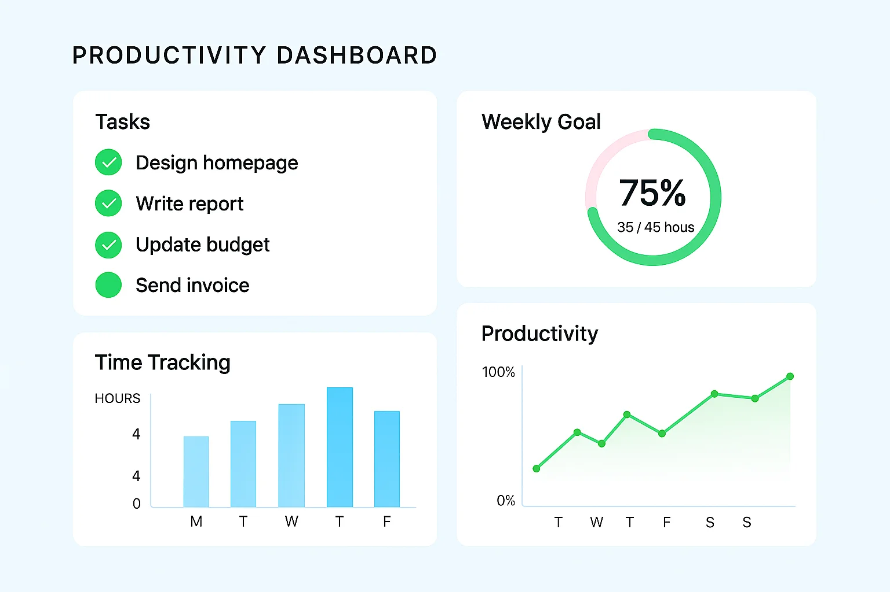
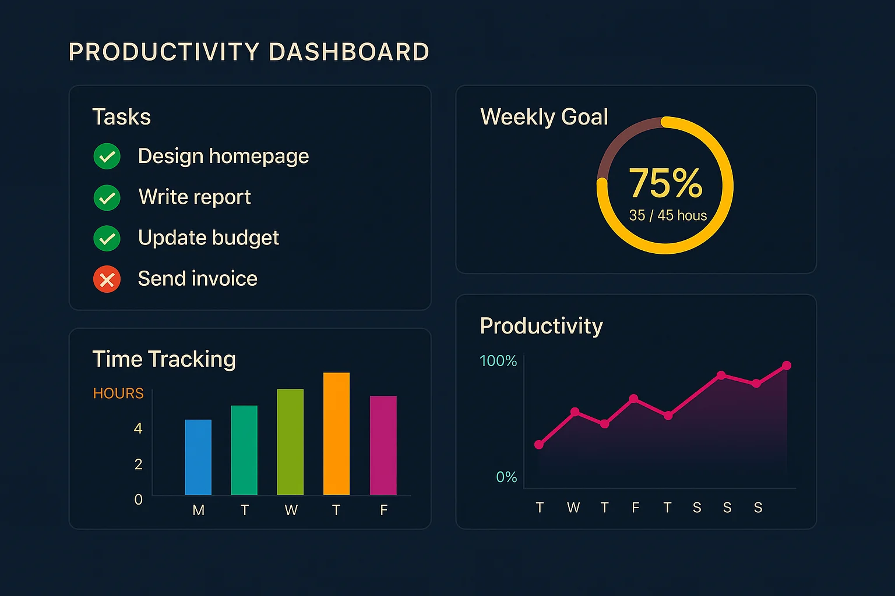

# 🌿 FlowNest – The Ultimate AI-Powered Productivity Ecosystem

[](https://flow-nest.vercel.app/)
[](https://reactjs.org/)
[](https://vite-pwa-org.netlify.app/)
[](https://firebase.google.com/)
[](https://tailwindcss.com/)
[](LICENSE)

> A modern, AI-enhanced, fully installable productivity management platform that helps you build better habits, achieve goals, and optimize your daily workflow with intelligent insights and cinematic focus environments.

## ✨ Key Flagship Features

### 🚀 **Progressive Web App (PWA)**
FlowNest is a fully installable PWA.
- **Native Experience**: Install directly to your Desktop, iOS, or Android device.
- **Offline Resilience**: Aggressive Service Worker caching ensures near-instant load times and graceful offline states.
- **Over-The-Air Updates**: Seamless background updates with beautiful UI toast notifications.

### 📋 **AI-Powered Drag-and-Drop Kanban Board**
A phenomenal Trello-style workflow manager built with `@hello-pangea/dnd`.
- **Fluid Drag & Drop**: Smoothly organize your tasks across "To Do", "In Progress", and "Done" columns.
- **Real-Time Database Sync**: Optimistic UI updates perfectly synchronized with Firebase Firestore.
- **"AI Organize" Magic**: One click allows the OpenRouter AI to analyze your chaotic backlog, determine priority, and automatically sort and reorganize the board for you!

### 🧘 **Immersive Zen Focus Room**
A cinematic, distraction-free environment designed to help you enter a deep flow state.
- **Full-Screen Takeover**: Utilizes the HTML5 Fullscreen API to eliminate browser distractions.
- **Ambient Soundscapes**: Built-in audio API featuring Rain, Cafe, and Forest ambient sounds.
- **Dynamic Environments**: Gorgeous CSS-animated backgrounds (Deep Space, Rainy Forest, Lo-Fi Cafe).
- **Synchronized Pomodoro**: A massive, elegant Pomodoro timer synced with your central stats.

### 🤖 **Revolutionary AI Integrations**
Powered by OpenRouter GPT-3.5 Turbo.
- **AI Chat Assistant**: 24/7 productivity coaching with contextual conversations.
- **Smart Task Prioritization**: Intelligent goal breakdown and schedule optimization.
- **Personalized Insights**: Context-aware advice based on your unique workflow.

### 🗓️ **Google Calendar Integration**
- **Seamless 2-Way Sync**: Connect your Google Calendar directly to your FlowNest dashboard.
- **Event Management**: Create, update, and manage your schedule without leaving the app.

### 📊 **Advanced Analytics & Habit Tracking**
- **Productivity Scoring**: AI-calculated 0-100 productivity score.
- **Habit Streaks**: Visual progress indicators and GitHub-style contribution graphs.
- **Focus Time Tracking**: Detailed charts mapping your deep work sessions over time using Recharts.

---

## 📸 Interface Previews

### Light Mode Dashboard


### Dark Mode Dashboard


---

## 🛠 Technical Architecture

### **Frontend Framework**
- **React 19.1.0** - Latest React with concurrent features
- **Vite 6.4.3** - Lightning-fast build tool and dev server
- **Tailwind CSS 4.1.5** - Utility-first CSS framework
- **Framer Motion 12.10.1** - Production-ready micro-interactions and layout animations
- **Vite PWA Plugin** - For Service Worker generation and App Manifest

### **Backend & Services**
- **Firebase 11.9.1** - Authentication, Firestore (NoSQL), and secure Security Rules
- **OpenRouter API** - LLM routing for advanced AI capabilities
- **GitHub Actions** - Continuous Integration (CI) pipeline running automated ESLint, Vitest, and Lighthouse CI checks on every push.

### **Data Visualization & UI**
- **Recharts 2.15.3** - Composable charting library
- **@hello-pangea/dnd** - Accessible drag and drop for lists and Kanban boards
- **React Icons 5.5.0** - Comprehensive icon library

---

## 📦 Installation & Setup

### Prerequisites
- Node.js 18+ and npm/yarn
- Firebase project with Firestore and Authentication enabled
- OpenRouter API key

### 1. Clone the Repository
```bash
git clone https://github.com/tanmay-7706/FlowNest.git
cd flownest
```

### 2. Install Dependencies
```bash
npm install
```

### 3. Environment Configuration
Create a `.env` file based on `.env.example`:

```bash
# Firebase Configuration
VITE_FIREBASE_API_KEY=your_firebase_api_key
VITE_FIREBASE_AUTH_DOMAIN=your_project.firebaseapp.com
VITE_FIREBASE_PROJECT_ID=your_project_id
VITE_FIREBASE_STORAGE_BUCKET=your_project.appspot.com
VITE_FIREBASE_MESSAGING_SENDER_ID=your_sender_id
VITE_FIREBASE_APP_ID=your_app_id
VITE_FIREBASE_MEASUREMENT_ID=your_measurement_id

# Google Gemini API (Fallback)
VITE_GEMINI_API_KEY=your_gemini_api_key
```

### 4. Firebase Setup
1. Create a new Firebase project
2. Enable Authentication (Email/Password)
3. Create Firestore database
4. Add your domain to authorized domains

### 5. Start Development Server
```bash
npm run dev
```

Visit `http://localhost:5173` to see your app running!

---

## 🔒 Security & Code Quality

- **Continuous Integration**: GitHub Actions pipeline automatically validates every commit.
- **Firestore Security Rules**: All collections strictly enforce authenticated, owner-only access rules to prevent unauthorized reads/writes.
- **Server-Side API Keys**: The OpenRouter API key runs exclusively through a Firebase Cloud Function (`functions/index.js`). It is **never** exposed in the client-side bundle.
- **Input Sanitization**: All Firestore writes are sanitized and cleaned via a custom `useFirestore` wrapper hook.
- **Offline Persistence**: Firestore IndexedDB persistence is enabled — data is cached locally and safely syncs when the user reconnects.

---

## 📄 License

This project is licensed under the MIT License - see the [LICENSE](LICENSE) file for details.

<div align="center">
  <strong>Built with ❤️ for productivity enthusiasts worldwide</strong>
  <br>
  <sub>© 2024 FlowNest. All rights reserved.</sub>
</div>
